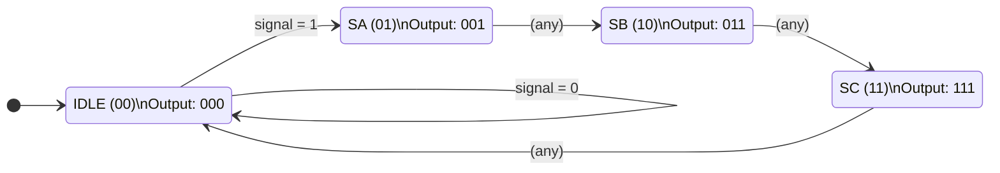
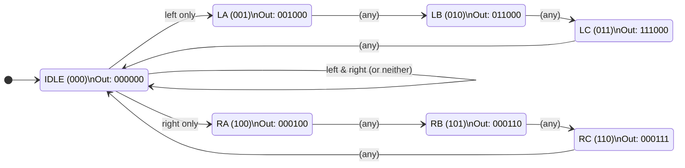

# Lab 4 – Part 1: FSM Design (Moore Machine)

## Design Choice: Single FSM for Both Directions

Left and right sequences are structurally identical, so one FSM handles both.
External logic routes the FSM's 3-bit output to either the left (`LA/LB/LC`) or right (`RA/RB/RC`) LEDs based on which signal is active.

| Condition | FSM input (`signal`) |
|-----------|----------------------|
| Only `left` active | `1` |
| Only `right` active | `1` |
| Both active | `0` → stays IDLE |
| Neither active | `0` → stays IDLE |

> **Reset:** asserting `rst` from **any** state immediately returns the FSM to `IDLE`.

---

## 1a) State Transition Diagram

> In a Moore machine the output is written **inside** the state node.  
> Transitions out of SA/SB/SC are unconditional (`x`) — the sequence always completes regardless of whether the signal is released mid-cycle.  
> Reset is a global override not shown per-arc for clarity.

---

## 1b) State Encoding Table

| State | Encoding | Description |
|-------|----------|-------------|
| IDLE  | `00`     | All lights off |
| SA    | `01`     | First light on |
| SB    | `10`     | First two lights on |
| SC    | `11`     | All three lights on |

---

## 1c) Output Logic Table

Output is 3 bits: `[C][B][A]` (active-high, `1` = light ON).

| State | Encoding | A | B | C | Output |
|-------|----------|---|---|---|--------|
| IDLE  | `00`     | 0 | 0 | 0 | `000`  |
| SA    | `01`     | 1 | 0 | 0 | `001`  |
| SB    | `10`     | 1 | 1 | 0 | `011`  |
| SC    | `11`     | 1 | 1 | 1 | `111`  |

---

## State Transition Table

| Current State | Input (`signal`) | Next State | Notes |
|---------------|-----------------|------------|-------|
| IDLE (`00`)   | `0`             | IDLE (`00`) | Stay idle |
| IDLE (`00`)   | `1`             | SA (`01`)   | Start sequence |
| SA (`01`)     | `x`             | SB (`10`)   | Always advance |
| SB (`10`)     | `x`             | SC (`11`)   | Always advance |
| SC (`11`)     | `x`             | IDLE (`00`) | End of cycle; restarts if signal still `1` next clock |
| Any           | `rst = 1`       | IDLE (`00`) | Synchronous reset, highest priority |

# Design Choice 2: 7 States (Pure Moore Machine)

In this variant the **direction is encoded in the state**, so the FSM drives all six
LEDs directly with no external routing logic. The system as a whole is a pure Moore machine.

The FSM has two inputs, `left` and `right`. From `IDLE` it branches into the left or
right chain; if both are pressed simultaneously it stays in `IDLE`.

> **Reset:** asserting `rst` from **any** state immediately returns the FSM to `IDLE`.

---

## 2a) State Transition Diagram

> Output is written **inside** each state node (Moore).  
> Transitions out of the LA/LB/LC and RA/RB/RC chains are unconditional (`x`) — the
> sequence always completes even if the signal is released mid-cycle, and repeats if
> the signal is still held on return to `IDLE`.

---

## 2b) State Encoding Table

| State | Encoding |
|-------|----------|
| IDLE  | `000`    |
| LA    | `001`    |
| LB    | `010`    |
| LC    | `011`    |
| RA    | `100`    |
| RB    | `101`    |
| RC    | `110`    |

---

## 2c) Output Logic Table

Output is 6 bits in the order `[LC LB LA RA RB RC]` (active-high, `1` = light ON).
The layout mirrors the physical tail-light symmetry around the center of the car.

| State | Encoding | LC | LB | LA | RA | RB | RC | Output   |
|-------|----------|----|----|----|----|----|----|----------|
| IDLE  | `000`    | 0  | 0  | 0  | 0  | 0  | 0  | `000000` |
| LA    | `001`    | 0  | 0  | 1  | 0  | 0  | 0  | `001000` |
| LB    | `010`    | 0  | 1  | 1  | 0  | 0  | 0  | `011000` |
| LC    | `011`    | 1  | 1  | 1  | 0  | 0  | 0  | `111000` |
| RA    | `100`    | 0  | 0  | 0  | 1  | 0  | 0  | `000100` |
| RB    | `101`    | 0  | 0  | 0  | 1  | 1  | 0  | `000110` |
| RC    | `110`    | 0  | 0  | 0  | 1  | 1  | 1  | `000111` |

---

## State Transition Table

| Current State | Input            | Next State | Notes |
|---------------|------------------|------------|-------|
| IDLE (`000`)  | neither / both   | IDLE (`000`) | Stay idle |
| IDLE (`000`)  | `left` only      | LA (`001`)   | Start left sequence |
| IDLE (`000`)  | `right` only     | RA (`100`)   | Start right sequence |
| LA (`001`)    | `x`              | LB (`010`)   | Always advance |
| LB (`010`)    | `x`              | LC (`011`)   | Always advance |
| LC (`011`)    | `x`              | IDLE (`000`) | End of left cycle |
| RA (`100`)    | `x`              | RB (`101`)   | Always advance |
| RB (`101`)    | `x`              | RC (`110`)   | Always advance |
| RC (`110`)    | `x`              | IDLE (`000`) | End of right cycle |
| Any           | `rst = 1`        | IDLE (`000`) | Synchronous reset, highest priority |

