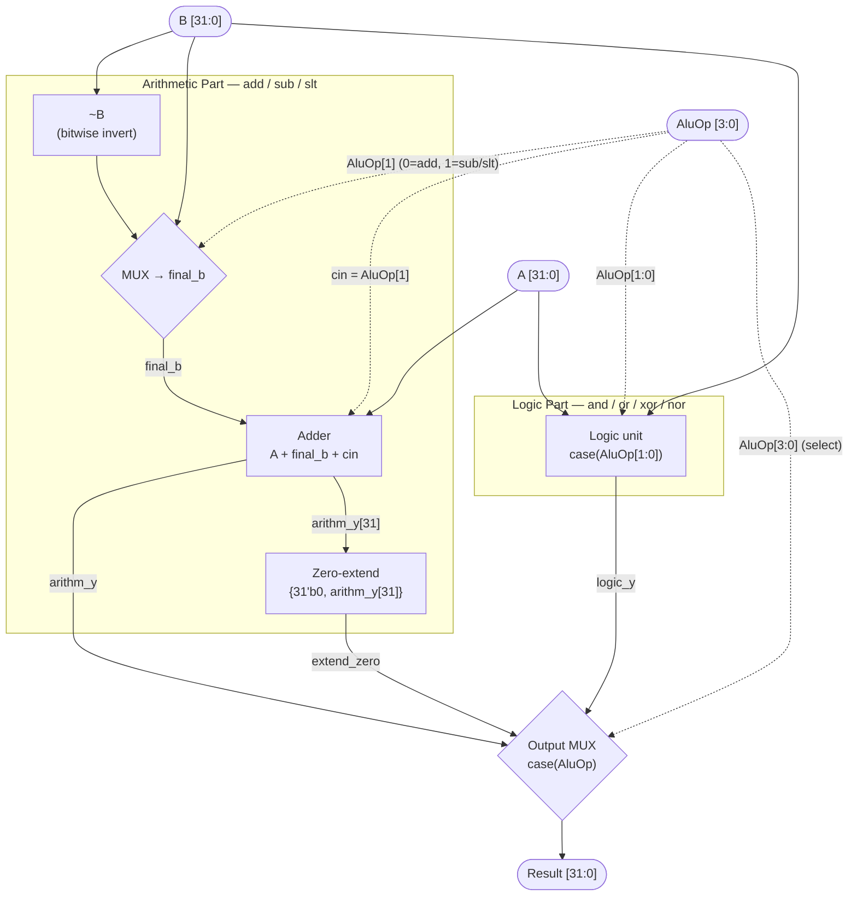

# Exercise 1: ALU Block Diagram

Block-level diagram of the 32-bit ALU, matching the Verilog implementation in
[`exercise_2.v`](exercise_2.v). Signal names are kept identical to the code
(`final_b`, `cin`, `arithm_y`, `logic_y`, `extend_zero`).

The `AluOp` bits split the design into an **Arithmetic Part** (`add`, `sub`,
`slt`) and a **Logic Part** (`and`, `or`, `xor`, `nor`). A final multiplexer
selects the result.

## Block Diagram

## How the blocks map to the Verilog

| Block in diagram | Verilog module / signal | Role |
| :--- | :--- | :--- |
| `~B` + `MUX → final_b` + `cin` | `Arithmetic` (`final_b`, `cin`) | Feeds `B` for **add** or `~B` + `cin=1` (two's-complement negate) for **sub** / **slt** |
| `Adder` | `Adder` → `arithm_y` | Single shared 32-bit adder: `A + final_b + cin` |
| `Zero-extend` | `assign extend_zero = {31'b0, arithm_y[31]}` | Takes the sign bit of `A − B` and zero-extends it to the 32-bit `slt` result |
| `Logic unit` | `Logic` → `logic_y` | `case(AluOp[1:0])` → AND / OR / XOR / NOR |
| `Output MUX` | `case(AluOp)` in `ALU` → `y` | Selects `arithm_y`, `logic_y`, or `extend_zero`; unlisted opcodes → `32'bx` (don't care) |

## Control mapping

| AluOp | Operation | Selected source at Output MUX |
| :--- | :--- | :--- |
| `0000` | add | `arithm_y` (`cin=0`, `final_b=B`) |
| `0010` | sub | `arithm_y` (`cin=1`, `final_b=~B`) |
| `0100` | and | `logic_y` |
| `0101` | or  | `logic_y` |
| `0110` | xor | `logic_y` |
| `0111` | nor | `logic_y` |
| `1010` | slt | `extend_zero` |
| others | — | don't care (`32'bx`) |

